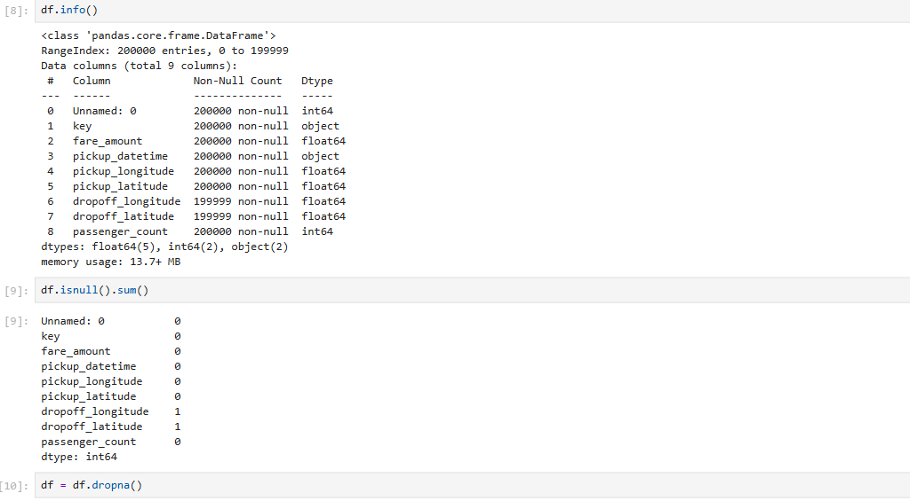
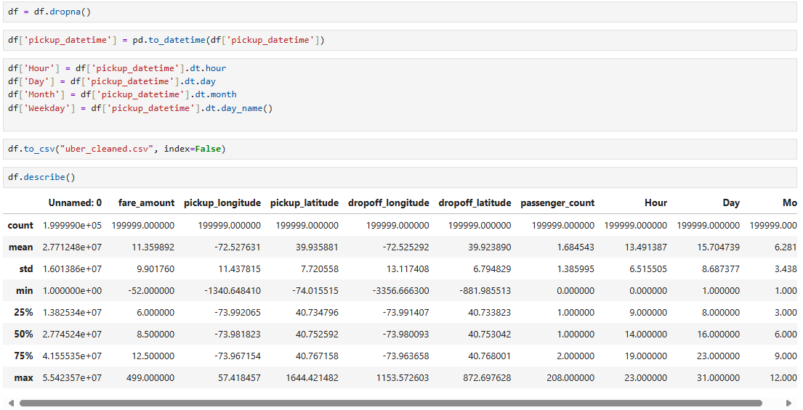
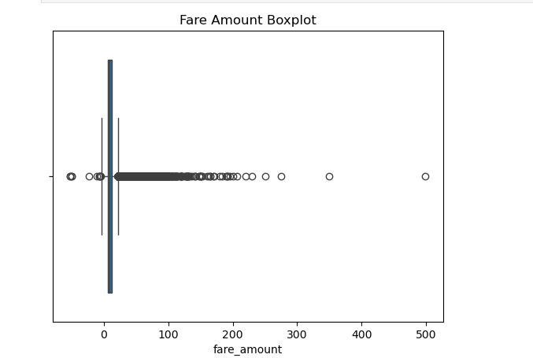

 #  Uber Fares Dataset Analysis – Power BI Project

###  Course: INSY 8413 – Introduction to Big Data Analytics  
###  Instructor: Prof. Eric Maniraguha  
###  Student: Akariza GASANA Leslie (27413)
###  Date: 23 July 2025
---

##  Project Overview
This project analyzes the **Uber Fares Dataset** to discover fare trends, ride demand patterns, and operational insights.  
The dataset was cleaned and enhanced using **Python (Jupyter Notebook)**, and an **interactive Power BI dashboard** was built to visualize key findings.

---

##  Objectives
- Understand the structure and quality of the dataset.
- Perform **data cleaning and feature engineering**.
- Conduct **exploratory data analysis (EDA)**.
- Build an **interactive Power BI dashboard** with KPIs and trends.
- Provide **actionable insights** and **business recommendations**.

---

## Project Structure

---

##  Key Visuals & Screenshots

### Data Preparation

### Data Import

### Visual Analysis

### Final Dashboard
.

---
##  Insights & Results

The analysis of Uber fares shows that most rides are within the $5–$15 range, with outliers above $50. The fare distribution is right-skewed with a median fare around $8–$10. Ride demand peaks during the morning (6–9 AM) and evening (4–7 PM) commuting hours, as well as on weekends, particularly Fridays and Saturdays. Average fares rise late at night, likely due to longer rides or surge pricing. Monthly patterns indicate that May  has the highest ride volume, suggesting seasonal demand variations. The fare vs. distance scatter plot confirms a strong positive correlation, where longer trips naturally lead to higher fares, though fare variability increases with distance. Based on these insights, it is recommended to implement dynamic pricing during peak periods, offer targeted promotions during off-peak hours, and validate any outlier fares above $50 to ensure data accuracy.

---

##  Recommendations
1. Implement surge pricing during peak hours (6–9 AM, 4–7 PM) and weekends.
2. Provide discounts or loyalty rewards during off-peak periods to balance demand.
3. Monitor outlier fares and anomalies to ensure data quality.
4. Explore adding weather and seasonal event data for deeper insights.

---

##  Credits
- **Dataset:** [Kaggle – Uber Fares Dataset](https://www.kaggle.com/datasets/yasserh/uber-fares-dataset)
